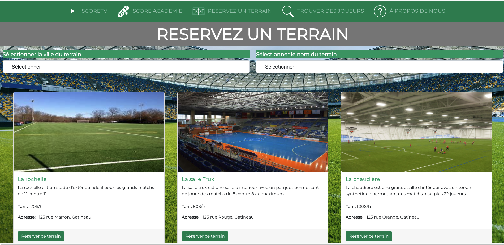

# Soccer Factory

Soccer Factory is a react-based frontend application with hardcoded data. The users can book a field, find players, register to courses and watch previous matches.

To run the application:

```cmd
npm install 
npm run start
```

## Some pictures of the application





